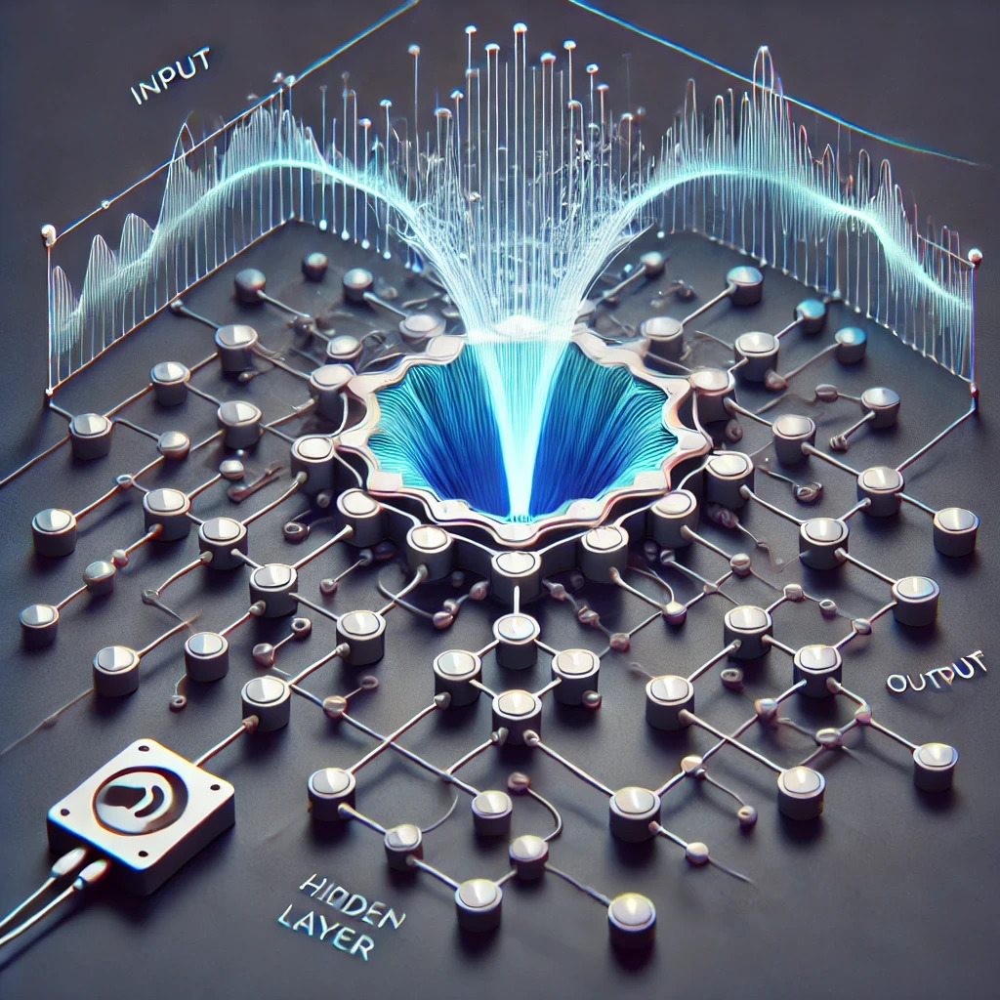
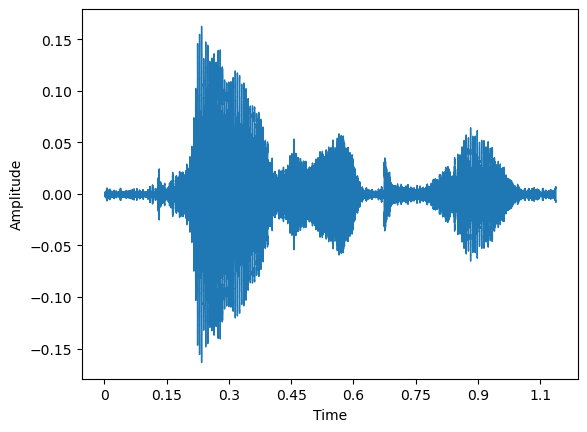
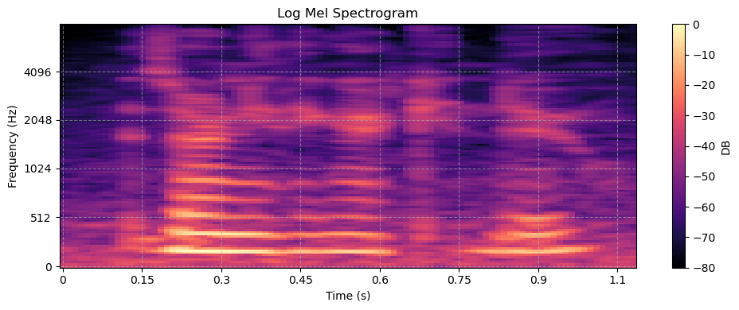

# RBTTS - an implementation of E2TTS (https://arxiv.org/abs/2406.18009)

Embarking on my second project, albeit one that could prove to be too challenging, as it delves into uncharted territory for me and demands skills I’m still mastering. My goal is to produce a natural-sounding, Text-To-Speech model using the Transformer architecture. Learning by coding directly (compared to online courses) has accelerated my knowledge base, however, so at the minimum I expect to gain a lot of insight into Transformers, in general.

# Model Architecture - Update to Conditional Flow-Based Model

After completing the creation of an encoder-decoder transformer, I will be implementing a flow-matching mel-spec generator.

### Earlier iteration of the project
This a classic transformer with encoder-decoder components and cross-attention. The encoder takes in input text, while the decoder takes in mel spectrograms, which represent the audio. The model will be trained with [teacher forcing](#teacher-forcing) with scheduled sampling. The input text will be broken into [phonemes](#phonemes) using the G2P library. This will be compared with E2 TTS flow-sampling for optimal results.

# Under Active Development

## Just completed: adding "FILL" tokens to text input so that they align with audio input according to E2TTS (https://arxiv.org/abs/2406.18009)
## Next step: come up with methodology to combine text and audio as per E2TTS

# Steps

## Pre-processing:
1) Gather suitable audio files and transcriptions (the normal route is to use publicly available data - I'll be using something more fun, however)
2) Create a tokenizer and encoder that uses padding as the input text I will be training on is variable in length. The choice of tokenizer is very important; I will begin with words, but will eventually use phonemes.
3) Express audio (wav) files as tensors using the Mel Scale
4) Ensure the tensors produced are correctly padded in such a way that the padding does not affect loss calculations
5) Calculate the mean and standard deviation of my starting data

## Model Coding:
1) TBC

## Post-processing:
1) [Vocoder](#vocoder)

# Intuition of a Text-to-Speech Model

## Physics of Sound Waves and Representing them as tensors

When sound is converted digitally onto a computer, the amplitude of the sound wave is sampled at a specified timestep. For example, if sound is being recorded at 22.05 kHz (a common fidelity for recorded sounds), each second the value of the sound wave's amplitude is recorded 22,050 times! Typically, these audio files (or WAV files) are stored on a computer where each timestep's amplitude is represented by 16-bits of a computer's memory. What this means is that, for each time step, the signal coming from the audio can be represented by a number bewteen -32,767 to 32,737 - and this happens 22,050 separate times in each second - that's a lot of granularity!

### Step 1: Convert WAV file into numbers representing the sound wave's amplitude at each timestep (1D NP.array)
Purpose: Representing an audio wave as numbers allows us to perform calculations and manipulate the numbers

### Step 2: Short-Time Fourier Transform (STFT)
Purpose: Converts the time-domain signal into a time-frequency representation.

### 3Blue1Brown YouTube Explanation

### Step 3: Magnitude Spectrogram
Purpose: Computes the magnitude (absolute value) of the complex STFT values, discarding phase information

### Step 4: Mel Spectrogram
Purpose: Projects the spectrogram onto a Mel scale (perceptual frequency scale).
n_mels: Number of Mel bands (e.g., 80 for speech processing).
Mel scale focuses on lower frequencies, which are more relevant for human perception.

### Step 5: Log-Mel Spectrogram:
Purpose: Converts the Mel spectrogram into a logarithmic scale (similar to decibels).
Logarithmic scaling is essential because human hearing perceives sound intensity logarithmically.

### Further resources
[Understanding sound waves and their numerical representations](https://medium.com/analytics-vidhya/understanding-the-mel-spectrogram-fca2afa2ce53)

# Vocoder
After we perform calculations on each sample, we would like to have a way to reassmble the numbers back into audio waves. However, it is not as simple as just reversing the math equations we applied to the initial numbers. One issue is that when the audio wave was initially converted into tensors, information is lost during this process (specifically when projecting the magnitude spectrogram onto a Mel scale - [Step 4](#step-4-mel-spectrogram))
Example of what it sounds like without using a vocoder: [no_vocoder_output.wav](no_vocoder_output.wav)

# Teacher Forcing

# Phonemes

## Files explained

1) config.json -> contain the model's hyperparameters
2) txtpreprocessing -> takes in sample text followed by cleaning, tokenizing, and encoding for the model's inputs (x)
3) voicepreprocessing -> takes in sample sound files (wavs), does maths on them to convert them into tensors for the model's targets (y)

# Flow-matched models

1) The goal is find how to get from a starting distribution (P0) to the target distribution (P1)
2) When you subtract P1 - P0, you are getting the straight-line path (displacement vector) required to move from P0 to P1
3) Train a neural network to predict the velocity field (drift) by assuming a straight line is needed to get P0 to P1. This allows the model to predict the vector field at all points t(0,1)
4) This helps the neural network learn how to smoothly transition the source distribution into the target distribution by modeling the flow field across the entire space, rather than just matching the endpoints.
5) The loss function, loss_fn(drift, line_directions), enforces this by penalizing the neural network if its predicted velocity (drift) deviates from the constant line_directions.
## In Summary:

The neural network is learning a velocity field for transforming the source distribution into the target. By training on interpolated samples at various tt, it ensures that the velocity predicted for each point matches the constant straight-line displacement vector, regardless of tt. This constraint teaches the network to approximate the linear transformation path while building capacity for more nuanced flows if needed.

Effectively, the neural network is a learned, more complex, and data-driven version of f(x,t)f(x,t), predicting how the points flow in the transformation process.

Key Idea:

    A differential equation like dxdt=f(x,t)dtdx​=f(x,t) describes how a point xx changes over time (tt).
    First-order methods assume the change (ΔxΔx) over a small step is approximately f(x,t)⋅Δtf(x,t)⋅Δt, where f(x,t)f(x,t) is the derivative or velocity.

### More Points Where Needed (via Time Warping)

You'll notice that trajectories are sharply curved in the middle, but are straight near the start and end. Just as you'd slow down when driving around a sharp turn, we should take smaller integration steps in these curved regions for accuracy.

One handy S-shaped time-warping function is this polynomial that lets us vary the concentration of points[^2]:

$$ f(t) =  4(1-s)t^3 + 6(s-1) t^2 + (3-2s)t, \ \ \ \ \ \  t\in[0,1], \ \ \ s\in[0,3/2] $$

[^2]: Note: my $f(t)$ is a close approximation to the "mode function" Eq. 20 in <a href="https://arxiv.org/abs/2403.03206">Esser et al</a>, with their $s$ being about (1.75 - $s_{\rm mine}$), and with $t\rightarrow 1-t$.  My blue line is right underneath their purple line in the Desmos graph below -- I didn't plan that, just similar minds at work!  Both our curves can do the Karras et al cosine schedule, shown in green in the the Desmos figure.

Train a reflowed model

# Challenges and Considerations

1) The model is not explicitly told the duration of each character pronounced, which can affect the speed of the voice at the end
2) The model is not explicitly told the phonetic pronounciations of words - the model will need to learn the associations itself
3) The use of absolute vs relative positional encodings to handle speech generation that is longer than the training data
4) Deciding whether or not to normalize mel specs (currently keeping it between -80 and 0 DB)
5) Deciding whether to add EOD token for mel spec decoder
6) Adjust Rope parameters

# Final debugging steps

1) Ensure only one voice by reviewing audio and removing unique voice samples
2) ensure text has same length (S) as audio targets; ensure special fillers added correctly to achieve this
3) Standardize mel specs by first determining training set mean and standard deviation and then applying it

# Things to study up on:

1) First-order numerical integration

https://colab.research.google.com/github/drscotthawley/blog/blob/main/extra/FlowModels_colab.ipynb#scrollTo=VAdp65wMqMiL

https://drscotthawley.github.io/blog/posts/FlowModels.html

https://diffusionflow.github.io/

https://implicit-layers-tutorial.org/?utm_source=chatgpt.com

https://uvadlc-notebooks.readthedocs.io/en/latest/tutorial_notebooks/DL2/Dynamical_systems/dynamical_systems_neural_odes.html?utm_source=chatgpt.com